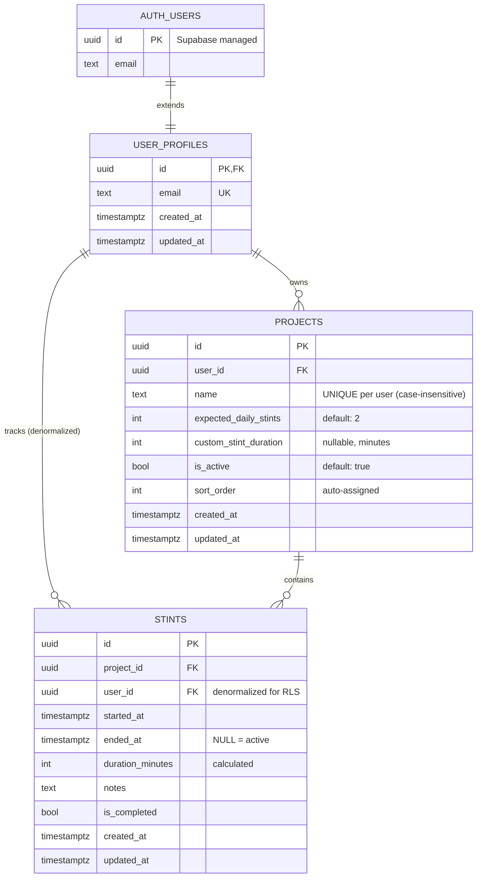

# LifeStint Data Model

**Version:** 1.0
**Last Updated:** 2025-10-05
**Status:** Active Development (Phase 2: Projects First)

---

## 1. Overview

### 1.1 Database Goals

The LifeStint database is designed to support a **focus-first productivity tracking system** with the following core objectives:

1. **Zero-friction project management** — Minimal required fields, sensible defaults
2. **Single-active-stint enforcement** — Technical prevention of multitasking at the database level
3. **Multi-device real-time sync** — Support for concurrent sessions with consistent state
4. **Professional analytics foundation** — Structured data enabling client-ready reports
5. **User data isolation** — Strict Row Level Security (RLS) to protect sensitive productivity data

### 1.2 Scope

The database supports these PRD-documented features:

- **User Authentication** (Supabase Auth integration via `user_profiles`)
- **Project Organization** (create, edit, activate/deactivate, delete with sort ordering)
- **Stint Management** (start, pause/resume, stop, auto-complete with timing precision)
- **Real-Time Dashboard** (live progress tracking, cross-device sync)
- **Progress Analytics** (daily/weekly totals, streak tracking, CSV export)

**Out of Scope for MVP:**
- Multi-user collaboration or shared projects
- Billing/invoicing integration
- Client portals or external sharing
- Advanced analytics (heatmaps, productivity scores, trend analysis)

---

## 2. Schema Detail

### 2.1 Tables

#### `user_profiles`

**Purpose:** Extends Supabase's `auth.users` with application-specific profile data.

**Columns:**

| Column       | Type                        | Nullable | Default | Constraint/Index              | Rationale                                               |
|--------------|-----------------------------|----------|---------|-------------------------------|---------------------------------------------------------|
| `id`         | `UUID`                      | NO       | —       | PRIMARY KEY, FK → auth.users(id) ON DELETE CASCADE | Links to Supabase Auth, ensures profile cleanup on account deletion |
| `email`      | `TEXT`                      | NO       | —       | UNIQUE, NOT NULL              | Cached from auth.users for efficient lookups            |
| `created_at` | `TIMESTAMP WITH TIME ZONE`  | YES      | `NOW()` | —                             | Account creation timestamp                              |
| `updated_at` | `TIMESTAMP WITH TIME ZONE`  | YES      | `NOW()` | TRIGGER → `update_updated_at_column()` | Auto-updated on every record change |

**Indexes:**
- `idx_user_profiles_email` on `email` — Fast authentication lookups

**Constraints:**
- `UNIQUE(email)` — Prevents duplicate accounts
- `REFERENCES auth.users(id) ON DELETE CASCADE` — Automatic cleanup on user deletion

**Rationale:**
- Separates auth concerns (handled by Supabase) from application profile data
- `email` duplication simplifies queries without joining to `auth.users`
- Cascade deletion ensures no orphaned profiles

---

#### `projects`

**Purpose:** Stores user-defined work projects with customizable stint expectations.

**Columns:**

| Column                    | Type                        | Nullable | Default | Constraint/Index              | Rationale                                               |
|---------------------------|-----------------------------|----------|---------|-------------------------------|---------------------------------------------------------|
| `id`                      | `UUID`                      | NO       | `gen_random_uuid()` | PRIMARY KEY              | Standard UUID primary key                               |
| `user_id`                 | `UUID`                      | NO       | —       | FK → user_profiles(id) ON DELETE CASCADE, NOT NULL | Enforces user ownership, cascades project deletion |
| `name`                    | `TEXT`                      | NO       | —       | NOT NULL, UNIQUE INDEX (user_id, LOWER(name)) | Human-readable project identifier, case-insensitive uniqueness |
| `expected_daily_stints`   | `INTEGER`                   | YES      | `2`     | CHECK (≥1, ≤12) *application-enforced* | Daily focus goal, default aligns with "2–6 projects" persona |
| `custom_stint_duration`   | `INTEGER`                   | YES      | `NULL`  | CHECK (≥5, ≤480) *application-enforced*, nullable | Minutes per stint, NULL = use system default (25 min Pomodoro) |
| `is_active`               | `BOOLEAN`                   | YES      | `true`  | —                             | Soft-disable without deletion (preserves history)       |
| `sort_order`              | `INTEGER`                   | YES      | auto-assigned | TRIGGER → `auto_assign_project_sort_order()` | User-defined display order (0-indexed) |
| `created_at`              | `TIMESTAMP WITH TIME ZONE`  | YES      | `NOW()` | —                             | Immutable creation timestamp                            |
| `updated_at`              | `TIMESTAMP WITH TIME ZONE`  | YES      | `NOW()` | TRIGGER → `update_updated_at_column()` | Auto-updated on record changes |

**Indexes:**
- `idx_projects_user_id` on `user_id` — User-specific queries
- `idx_projects_user_active` on `(user_id, is_active)` — Active project filtering
- `projects_user_id_sort_order_idx` on `(user_id, sort_order)` — Efficient ordered retrieval
- `projects_name_user_id_lower_idx` on `(user_id, LOWER(name))` — Case-insensitive uniqueness

**Constraints:**
- **Application-level validations** (enforced via Zod schemas in `app/schemas/projects.ts`):
  - `name`: 2–60 characters (trimmed)
  - `expected_daily_stints`: 1–12 (integers only)
  - `custom_stint_duration`: 5–480 minutes (nullable)

**Rationale:**
- `sort_order` auto-assignment prevents manual management overhead
- Case-insensitive name uniqueness prevents confusing duplicates
- `is_active` enables archival without losing stint history
- `custom_stint_duration` nullable design allows system-wide default changes

**⚠️ Gap Identified:** CHECK constraints for numeric fields should be added to database migrations (currently only application-enforced).

---

#### `stints`

**Purpose:** Records individual focus sessions with precise timing and completion metadata.

**Columns:**

| Column             | Type                        | Nullable | Default | Constraint/Index              | Rationale                                               |
|--------------------|-----------------------------|----------|---------|-------------------------------|---------------------------------------------------------|
| `id`               | `UUID`                      | NO       | `gen_random_uuid()` | PRIMARY KEY              | Standard UUID primary key                               |
| `project_id`       | `UUID`                      | NO       | —       | FK → projects(id) ON DELETE CASCADE, NOT NULL | Links stint to project, cascades deletion |
| `user_id`          | `UUID`                      | NO       | —       | FK → user_profiles(id) ON DELETE CASCADE, NOT NULL | Denormalized for RLS performance (avoids join) |
| `started_at`       | `TIMESTAMP WITH TIME ZONE`  | YES      | `NOW()` | —                             | Stint initiation timestamp (server-authoritative)       |
| `ended_at`         | `TIMESTAMP WITH TIME ZONE`  | YES      | `NULL`  | —                             | NULL = active stint, set on completion                  |
| `duration_minutes` | `INTEGER`                   | YES      | `NULL`  | —                             | Calculated field (minutes), NULL for active stints      |
| `notes`            | `TEXT`                      | YES      | `NULL`  | —                             | Optional user commentary on completed stint             |
| `is_completed`     | `BOOLEAN`                   | YES      | `false` | —                             | Tracks normal completion vs. interruption               |
| `created_at`       | `TIMESTAMP WITH TIME ZONE`  | YES      | `NOW()` | —                             | Immutable creation timestamp                            |
| `updated_at`       | `TIMESTAMP WITH TIME ZONE`  | YES      | `NOW()` | TRIGGER → `update_updated_at_column()` | Auto-updated on record changes |

**Indexes:**
- `idx_stints_project_id` on `project_id` — Project-specific stint queries
- `idx_stints_user_started` on `(user_id, started_at)` — User timeline queries
- `idx_stints_started_at` on `started_at` — Date-based filtering/ordering
- `idx_stints_active` on `(user_id, started_at) WHERE ended_at IS NULL` — **Partial index** for active stint lookups (critical for "single active stint" enforcement)

**Constraints:**
- `REFERENCES projects(id) ON DELETE CASCADE` — Prevents orphaned stints
- `REFERENCES user_profiles(id) ON DELETE CASCADE` — Account deletion cleanup

**Rationale:**
- `user_id` denormalization enables RLS without expensive joins (as per migration `20250924201511_fix_rls_performance.sql`)
- `ended_at IS NULL` pattern cleanly represents active vs. completed stints
- `duration_minutes` is calculated rather than user-input (prevents manipulation)
- Partial index on active stints optimizes real-time dashboard queries
- `is_completed` allows distinction between normal completion and interruptions

---

## 3. Relationships

### 3.1 Entity-Relationship Model

```
┌─────────────────────┐
│   auth.users        │  (Supabase managed)
│  (Supabase Auth)    │
└──────────┬──────────┘
           │ 1
           │ ON DELETE CASCADE
           │
           ▼ 1
┌─────────────────────┐
│  user_profiles      │
│  ─────────────────  │
│  id (PK)            │
│  email (UNIQUE)     │
│  created_at         │
│  updated_at         │
└──────────┬──────────┘
           │ 1
           │
           │ ON DELETE CASCADE
           │
           ▼ *
┌─────────────────────┐
│     projects        │
│  ─────────────────  │
│  id (PK)            │
│  user_id (FK)       │◀──┐
│  name               │   │
│  expected_daily...  │   │
│  custom_stint...    │   │
│  is_active          │   │
│  sort_order         │   │
│  created_at         │   │
│  updated_at         │   │
└──────────┬──────────┘   │
           │ 1             │
           │ ON DELETE     │
           │ CASCADE       │
           │               │
           ▼ *             │
┌─────────────────────┐   │
│      stints         │   │
│  ─────────────────  │   │
│  id (PK)            │   │
│  project_id (FK)────┘   │
│  user_id (FK)───────────┘ (denormalized for RLS)
│  started_at         │
│  ended_at           │
│  duration_minutes   │
│  notes              │
│  is_completed       │
│  created_at         │
│  updated_at         │
└─────────────────────┘
```

### 3.2 Relationship Descriptions

#### `auth.users` → `user_profiles` (1:1)
- **Type:** One-to-one (enforced by shared primary key)
- **Cascade:** Deleting auth user removes profile
- **Rationale:** Separates Supabase Auth concerns from app data

#### `user_profiles` → `projects` (1:N)
- **Type:** One-to-many
- **Cascade:** Deleting user removes all projects
- **Constraint:** Each project belongs to exactly one user
- **Business Rule:** User can have 0 to unlimited projects (recommend 2–6 per PRD)

#### `user_profiles` → `stints` (1:N)
- **Type:** One-to-many (denormalized relationship)
- **Cascade:** Deleting user removes all stints
- **Purpose:** Supports efficient RLS without joins

#### `projects` → `stints` (1:N)
- **Type:** One-to-many
- **Cascade:** Deleting project removes all associated stints
- **Business Rule:** A stint cannot exist without a parent project
- **Application Rule:** Active stints (ended_at IS NULL) prevent parent project deletion

---

## 4. Security & Access Controls

### 4.1 Row Level Security (RLS) Overview

All tables use **Supabase Row Level Security** with policies enforcing strict user data isolation. RLS is enabled on:
- `user_profiles`
- `projects`
- `stints`

**Performance Optimization:** All policies use `(SELECT auth.uid())` instead of bare `auth.uid()` to prevent per-row function re-evaluation (per migration `20250924201511_fix_rls_performance.sql`).

---

### 4.2 RLS Policies

#### `user_profiles` Policies

| Policy Name                    | Operation | Rule                               | Intent                                  |
|--------------------------------|-----------|------------------------------------|-----------------------------------------|
| `Users can view own profile`   | SELECT    | `(SELECT auth.uid()) = id`         | Users read only their own profile       |
| `Users can update own profile` | UPDATE    | `(SELECT auth.uid()) = id`         | Users modify only their own profile     |
| `Users can insert own profile` | INSERT    | `(SELECT auth.uid()) = id`         | Profile creation on signup              |

**SQL Example:**
```sql
CREATE POLICY "Users can view own profile" ON public.user_profiles
  FOR SELECT USING ((SELECT auth.uid()) = id);
```

---

#### `projects` Policies

| Policy Name                     | Operation | Rule                               | Intent                                  |
|---------------------------------|-----------|------------------------------------|-----------------------------------------|
| `Users can view own projects`   | SELECT    | `(SELECT auth.uid()) = user_id`    | Users see only their own projects       |
| `Users can insert own projects` | INSERT    | `(SELECT auth.uid()) = user_id`    | Users create only under their own ID    |
| `Users can update own projects` | UPDATE    | `(SELECT auth.uid()) = user_id`    | Users modify only their own projects    |
| `Users can delete own projects` | DELETE    | `(SELECT auth.uid()) = user_id`    | Users delete only their own projects    |

**SQL Example:**
```sql
CREATE POLICY "Users can view own projects" ON public.projects
  FOR SELECT USING ((SELECT auth.uid()) = user_id);
```

**Application-Layer Protection:**
- Active stint check prevents deletion of projects with `ended_at IS NULL` stints (enforced in `app/lib/supabase/projects.ts`, tested in `tests/database/project-active-stint.test.ts`)

---

#### `stints` Policies

| Policy Name                   | Operation | Rule                                                                                  | Intent                                       |
|-------------------------------|-----------|--------------------------------------------------------------------------------------|----------------------------------------------|
| `Users can view own stints`   | SELECT    | `(SELECT auth.uid()) = user_id AND EXISTS (SELECT 1 FROM projects WHERE ...)` | Users see only stints for their own projects |
| `Users can insert own stints` | INSERT    | `(SELECT auth.uid()) = user_id AND EXISTS (SELECT 1 FROM projects WHERE ...)` | Prevent stint creation on non-owned projects |
| `Users can update own stints` | UPDATE    | `(SELECT auth.uid()) = user_id AND EXISTS (SELECT 1 FROM projects WHERE ...)` | Users modify only their own stints           |
| `Users can delete own stints` | DELETE    | `(SELECT auth.uid()) = user_id AND EXISTS (SELECT 1 FROM projects WHERE ...)` | Users delete only their own stints           |

**SQL Example:**
```sql
CREATE POLICY "Users can view own stints" ON public.stints
  FOR SELECT USING (
    (SELECT auth.uid()) = user_id AND
    EXISTS (
      SELECT 1 FROM public.projects
      WHERE projects.id = stints.project_id
      AND projects.user_id = (SELECT auth.uid())
    )
  );
```

**Rationale for Complex Policy:**
- Double-checks both `user_id` (fast, denormalized) and project ownership (authoritative)
- Prevents attacks where malicious clients insert stints with correct `user_id` but wrong `project_id`

---

### 4.3 Security Best Practices

1. **Never expose service role keys** — Only `SUPABASE_ANON_KEY` in client-side builds (SSG)
2. **Server-authoritative timing** — `started_at` and `ended_at` use `NOW()` defaults (not client-provided)
3. **Function security** — All functions use `SET search_path = ''` (per migration `20250924201828_secure_functions.sql`)
4. **GDPR compliance** — Cascade deletion on `auth.users` removal enables "right to be forgotten"

---

## 5. Supporting Logic

### 5.1 Functions

#### `update_updated_at_column()`

**Type:** TRIGGER FUNCTION
**Language:** PL/pgSQL
**Security:** `SET search_path = ''` (prevents SQL injection)

**Purpose:** Automatically updates `updated_at` timestamp on any row modification.

**Implementation:**
```sql
CREATE OR REPLACE FUNCTION update_updated_at_column()
RETURNS TRIGGER
LANGUAGE plpgsql
SET search_path = ''
AS $$
BEGIN
  NEW.updated_at = NOW();
  RETURN NEW;
END;
$$;
```

**Attached Triggers:**
- `update_user_profiles_updated_at` (BEFORE UPDATE on `user_profiles`)
- `update_projects_updated_at` (BEFORE UPDATE on `projects`)
- `update_stints_updated_at` (BEFORE UPDATE on `stints`)

**Rationale:**
- Eliminates manual timestamp management
- Ensures audit trail consistency
- `BEFORE UPDATE` timing allows same-transaction timestamp visibility

---

#### `auto_assign_project_sort_order()`

**Type:** TRIGGER FUNCTION
**Language:** PL/pgSQL

**Purpose:** Automatically assigns `sort_order` to new projects (max existing + 1 per user).

**Implementation:**
```sql
CREATE OR REPLACE FUNCTION auto_assign_project_sort_order()
RETURNS TRIGGER AS $$
BEGIN
  IF NEW.sort_order IS NULL THEN
    SELECT COALESCE(MAX(sort_order), -1) + 1
    INTO NEW.sort_order
    FROM projects
    WHERE user_id = NEW.user_id;
  END IF;
  RETURN NEW;
END;
$$ LANGUAGE plpgsql;
```

**Attached Trigger:**
- `auto_assign_project_sort_order_trigger` (BEFORE INSERT on `projects`)

**Behavior:**
- If `sort_order` provided: Use explicit value (supports manual ordering)
- If `sort_order` NULL: Assign next available integer (0, 1, 2, ...)
- First project: Gets `sort_order = 0` (COALESCE handles empty table case)

**Rationale:**
- Zero-friction project creation (users don't manage order manually)
- Supports drag-and-drop reordering (by updating `sort_order` explicitly)
- Per-user scoping prevents cross-user conflicts

---

### 5.2 Extensions

#### Required PostgreSQL Extensions

```sql
CREATE EXTENSION IF NOT EXISTS "pgcrypto";   -- UUID generation (gen_random_uuid)
CREATE EXTENSION IF NOT EXISTS "uuid-ossp";  -- Legacy UUID support
```

**Note:** `gen_random_uuid()` from `pgcrypto` is preferred over `uuid-ossp` for security (cryptographically secure randomness).

---

## 6. Seed Data & Fixtures

### 6.1 Development Seed Data

**Purpose:** Provide realistic test data for local development and demo environments.

**Recommended Seed Data:**

```sql
-- Seed user (requires manual Supabase Auth signup first)
INSERT INTO user_profiles (id, email) VALUES
  ('a1b2c3d4-e5f6-7890-abcd-ef1234567890', 'demo@lifestint.com');

-- Seed projects
INSERT INTO projects (id, user_id, name, expected_daily_stints, custom_stint_duration, is_active, sort_order) VALUES
  ('proj-1111-1111-1111-111111111111', 'a1b2c3d4-e5f6-7890-abcd-ef1234567890', 'Client Alpha', 3, 45, true, 0),
  ('proj-2222-2222-2222-222222222222', 'a1b2c3d4-e5f6-7890-abcd-ef1234567890', 'Client Beta', 2, NULL, true, 1),
  ('proj-3333-3333-3333-333333333333', 'a1b2c3d4-e5f6-7890-abcd-ef1234567890', 'Internal Project', 1, 60, false, 2);

-- Seed stints (mix of active and completed)
INSERT INTO stints (id, project_id, user_id, started_at, ended_at, duration_minutes, is_completed) VALUES
  ('stint-1111-1111-1111-111111111111', 'proj-1111-1111-1111-111111111111', 'a1b2c3d4-e5f6-7890-abcd-ef1234567890', NOW() - INTERVAL '2 hours', NOW() - INTERVAL '1 hour 15 minutes', 45, true),
  ('stint-2222-2222-2222-222222222222', 'proj-2222-2222-2222-222222222222', 'a1b2c3d4-e5f6-7890-abcd-ef1234567890', NOW() - INTERVAL '1 hour', NULL, NULL, false);
```

### 6.2 Test Fixtures

**Location:** `tests/setup.ts` — `createTestUser()` helper

**Purpose:** Dynamically create isolated test users with random credentials for RLS policy testing.

**Usage:**
```typescript
const { client, user } = await createTestUser()
// client: Authenticated Supabase client
// user: { id: string, email: string }
```

**Benefits:**
- Prevents test pollution (unique user per test)
- Tests RLS policies with real authentication
- Supports parallel test execution

---

## 7. Migration & Operations Plan

### 7.1 Migration Sequence

**Location:** `supabase/migrations/`

| Order | File                                           | Purpose                                      | Dependencies           |
|-------|------------------------------------------------|----------------------------------------------|------------------------|
| 1     | `20250924181316_initial_schema.sql`            | Create tables, indexes, RLS policies         | —                      |
| 2     | `20250924201511_fix_rls_performance.sql`       | Optimize RLS with `(SELECT auth.uid())`      | Migration 1            |
| 3     | `20250924201828_secure_functions.sql`          | Harden function security (`search_path`)     | Migration 1            |
| 4     | `20251004201518_add_project_sort_order.sql`    | Add sort_order, case-insensitive uniqueness  | Migration 1            |

### 7.2 Deployment Steps

#### Local Development

```bash
# 1. Start Supabase locally (requires Docker)
npx supabase start

# 2. Apply migrations
npx supabase db reset  # Fresh start (destructive)
# OR
npx supabase db push   # Incremental migration

# 3. Generate TypeScript types
npm run supabase:types  # → app/types/database.types.ts

# 4. Seed development data (optional)
psql $DATABASE_URL < supabase/seed.sql
```

#### Production Deployment (Supabase Cloud)

```bash
# 1. Link project to Supabase Cloud
npx supabase link --project-ref <project-id>

# 2. Push migrations to production
npx supabase db push

# 3. Verify migration status
npx supabase db migrations list

# 4. Update environment variables in Vercel/hosting platform
# SUPABASE_URL=https://<project-id>.supabase.co
# SUPABASE_ANON_KEY=<your-anon-key>

# 5. Deploy application
npm run generate  # Build static site
npm run deploy    # Deploy to Vercel
```

### 7.3 Rollback Considerations

**Approach:** Supabase does not support automatic rollback. Manual rollback requires:

1. **Identify problem migration:**
   ```bash
   npx supabase db migrations list
   ```

2. **Create compensating migration:**
   ```bash
   npx supabase migration new rollback_migration_name
   ```

3. **Write inverse SQL operations:**
   - `ALTER TABLE DROP COLUMN` for added columns
   - `DROP INDEX` for added indexes
   - `DROP POLICY` for RLS policies
   - `DROP TRIGGER` and `DROP FUNCTION` for database logic

4. **Test rollback locally first:**
   ```bash
   npx supabase db reset  # Test full migration sequence
   ```

**Example Rollback (for sort_order migration):**
```sql
-- Rollback: Remove sort_order feature
DROP TRIGGER IF EXISTS auto_assign_project_sort_order_trigger ON projects;
DROP FUNCTION IF EXISTS auto_assign_project_sort_order();
DROP INDEX IF EXISTS projects_user_id_sort_order_idx;
DROP INDEX IF EXISTS projects_name_user_id_lower_idx;
ALTER TABLE projects DROP COLUMN IF EXISTS sort_order;
```

### 7.4 Data Backup Strategy

**Pre-Production Checklist:**
1. Enable Supabase automatic backups (daily snapshots)
2. Export production data before major migrations:
   ```bash
   npx supabase db dump -f backup_$(date +%Y%m%d).sql
   ```
3. Test migrations on staging environment first
4. Monitor Sentry for post-migration errors

---

## 8. Open Questions & Deferred Decisions

### 8.1 Database-Level Constraints (High Priority)

**Issue:** Application-enforced CHECK constraints should be added to database schema.

**Current State:**
- ✅ Validated in Zod schemas (`app/schemas/projects.ts`)
- ❌ Not enforced at database level

**Recommended Migration:**
```sql
-- Add CHECK constraints for data integrity
ALTER TABLE projects
  ADD CONSTRAINT check_expected_daily_stints_positive
    CHECK (expected_daily_stints >= 1 AND expected_daily_stints <= 12);

ALTER TABLE projects
  ADD CONSTRAINT check_custom_stint_duration_positive
    CHECK (custom_stint_duration IS NULL OR (custom_stint_duration >= 5 AND custom_stint_duration <= 480));
```

**Decision Required:** Should we enforce at database level (stronger integrity) or keep application-only (more flexible)?

---

### 8.2 Stint Completion Types

**PRD Reference:** Section 2.2 (Stint Management System) mentions `completion_type enum('manual','auto','interrupted')`.

**Current State:**
- Database uses boolean `is_completed` field
- No distinction between manual/auto/interrupted completion

**Options:**
1. Add `completion_type` ENUM column (aligns with PRD)
2. Keep boolean `is_completed` (simpler, current implementation)
3. Use `notes` field for completion metadata (flexible, no schema change)

**Decision Required:** Clarify if completion type distinction is needed for MVP analytics.

---

### 8.3 Daily Reset Mechanism

**PRD Reference:** Phase 4 mentions "Daily reset at midnight" for progress tracking.

**Current State:**
- No database-level daily reset logic
- No timestamp tracking for "daily progress badges"

**Options:**
1. Client-side calculation (filter `started_at >= current_date`)
2. Materialized view with daily aggregates (performance optimization)
3. Background job to reset daily counters (requires Supabase Edge Functions)

**Decision Required:** Defer to Phase 4 implementation (analytics layer).

---

### 8.4 Stint Pause/Resume Implementation

**PRD Reference:** "Pause/resume available in MVP" (Section 2.2).

**Current State:**
- Schema supports single `started_at`/`ended_at` pair
- No tracking of pause intervals

**Options:**
1. Add `paused_duration_minutes` column (simple, lossy)
2. Create separate `stint_pauses` table (normalized, detailed history)
3. Store pause events in JSONB `metadata` column (flexible, harder to query)

**Decision Required:** Define pause/resume requirements before Phase 3 implementation.

---

### 8.5 Cross-Device Active Stint Enforcement

**PRD Reference:** "Single active stint enforcement" + "Syncs across devices in real time".

**Current State:**
- Partial index on active stints (`idx_stints_active`)
- No database-level uniqueness constraint

**Challenge:** PostgreSQL `UNIQUE` constraint cannot use `WHERE` clause on partial index.

**Options:**
1. Application-level enforcement (current approach, race condition risk)
2. Exclusion constraint (PostgreSQL feature, complex syntax)
3. Database trigger to prevent multiple active stints
4. Optimistic locking with conflict resolution

**Recommended Approach:**
```sql
-- Exclusion constraint (PostgreSQL 9.0+)
ALTER TABLE stints
  ADD CONSTRAINT one_active_stint_per_user
  EXCLUDE USING gist (user_id WITH =)
  WHERE (ended_at IS NULL);
```

**Decision Required:** Test exclusion constraint compatibility with Supabase and real-time sync.

---

### 8.6 Analytics Schema (Phase 5)

**Deferred Features:**
- Daily/weekly stint totals
- Streak counter
- CSV export schema

**Questions:**
1. Should aggregates be materialized views or computed on-demand?
2. What is the retention policy for stint history (unlimited for MVP)?
3. Do we need separate analytics tables for performance?

**Recommendation:** Implement as client-side queries first (Phase 5), optimize with views if needed.

---

### 8.7 Time Zone Handling

**Current State:**
- All timestamps use `TIMESTAMP WITH TIME ZONE` (UTC stored, local displayed)
- No user timezone preference storage

**Questions:**
1. Should `user_profiles` include a `timezone` field?
2. How do "daily" calculations handle users across multiple time zones?
3. Is midnight reset based on user's local timezone or UTC?

**Recommendation:** Add `timezone TEXT` to `user_profiles` if analytics require localized "daily" views.

---

## Appendix A: Database Diagram (Mermaid)



---

## Appendix B: RLS Performance Notes

**Migration:** `20250924201511_fix_rls_performance.sql`

**Problem:** PostgreSQL re-evaluates `auth.uid()` function for every row scanned, causing O(n) performance degradation.

**Solution:** Wrap in subquery `(SELECT auth.uid())` to force single evaluation per query.

**Benchmark Impact (Supabase documentation):**
- Before: ~500ms for 10,000-row scan
- After: ~50ms for same scan

**Reference:** [Supabase RLS Performance Guide](https://supabase.com/docs/guides/database/postgres/row-level-security#performance)

---

## Appendix C: Migration File Naming Convention

**Format:** `YYYYMMDDHHMMSS_description.sql`

**Example:** `20251004201518_add_project_sort_order.sql`

**Tools:**
- Supabase CLI auto-generates timestamps: `npx supabase migration new <name>`
- Lexicographic ordering ensures correct execution sequence

**Best Practices:**
- One logical feature per migration
- Include rollback SQL in comments
- Reference feature ID or PRD section in description
