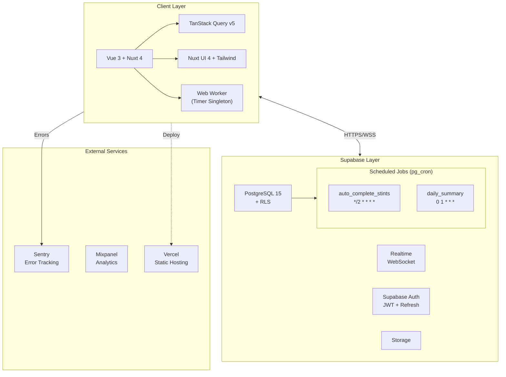
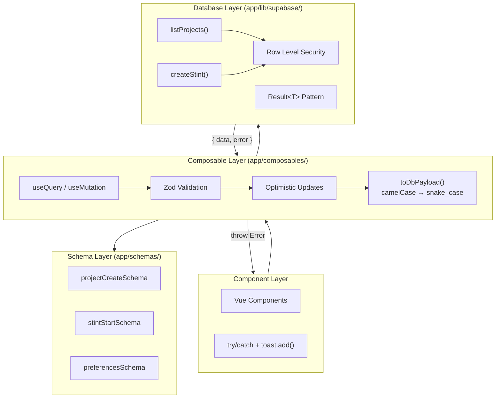
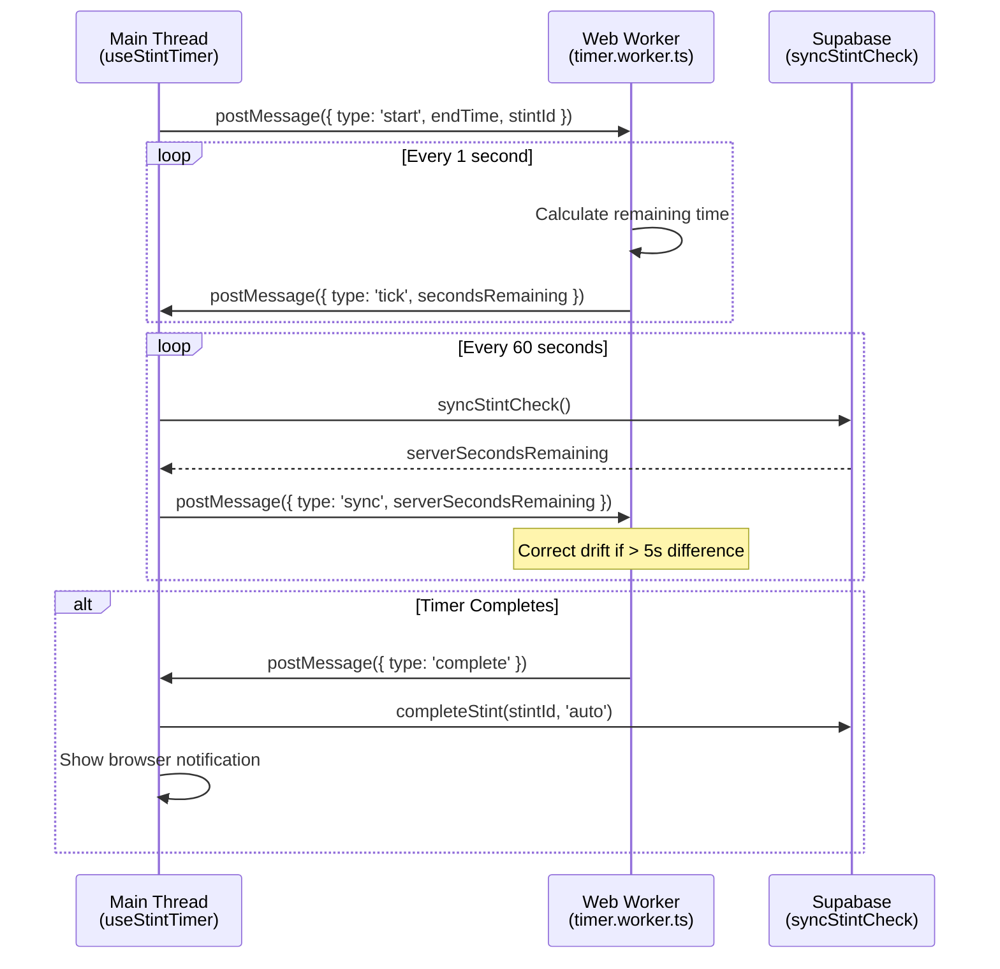
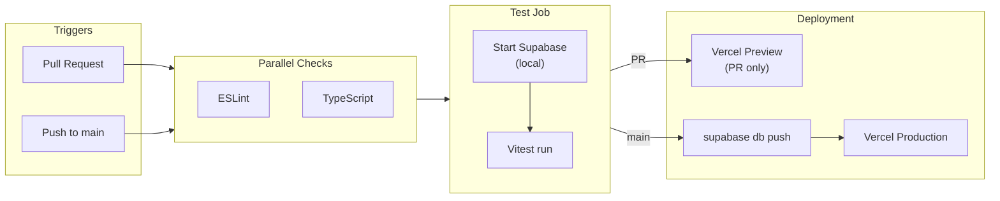

# LifeStint - Technical Architecture

**Product Name:** LifeStint
**Document Version:** 4.1
**Date:** January 24, 2026

---

## System Overview

---

## Frontend Stack

### Framework

- **Vue 3** (Composition API)
  - Reactive state management
  - Component-based architecture
  - TypeScript support
- **Nuxt 4** (Vue meta-framework)
  - File-based routing
  - SSR/SSG capabilities (for marketing pages)
  - Auto-imports for components
  - Built-in optimization

### UI Framework

- **Nuxt UI 4**
  - Pre-built accessible components
  - Dark mode support out of box
  - Tailwind CSS integration
  - Minimal custom CSS needed

### State Management

- **TanStack Query (Vue Query)**
  - Pure query-based architecture (no Pinia/Vuex stores)
  - All server state managed through TanStack Query cache
  - Automatic caching with configurable stale times
  - Background refetching and cache invalidation
- **Query Key Factory Pattern**
  - Centralized cache key organization
  - Hierarchical keys for targeted invalidation
  - Type-safe query key definitions
- **Optimistic Updates**
  - Immediate UI feedback before server response
  - Automatic rollback on mutation failure
  - Cache snapshot and restore on error
- **Composables**
  - useStintTimer (Web Worker singleton for accurate timing)
  - useProjects / useStints (TanStack Query data access)
  - useAuthUser (Auth state management)

### Data Layer Architecture

The codebase follows a strict three-layer data access pattern:

**Key Patterns:**
- `toDbPayload()`: Transforms camelCase schema fields to snake_case database columns
- `Result<T>`: All database functions return `{ data, error }` for consistent error handling
- Errors propagate up: Database → Composable (throws) → Component (try/catch + toast)

### Styling

- **Tailwind CSS 4** (via Nuxt UI)
  - Utility-first styling
  - Responsive design system
  - Dark mode variants
  - Semantic color palette (primary, secondary, success, warning, error, neutral)

### Charts

- **Chart.js**
  - Bar charts for daily/weekly summaries
  - Line charts for trend analysis
  - Lightweight, tree-shakeable

### Real-Time

- **Supabase Realtime Client**
  - WebSocket connections
  - Automatic reconnection
  - Subscription management
  - Broadcast events for stint updates

### Utility Libraries

- **VueUse** (@vueuse/core, @vueuse/integrations)
  - Composition API utilities
  - Browser API wrappers (useStorage, useEventListener)
  - Third-party integrations
- **SortableJS**
  - Drag-and-drop for project reordering
  - Touch-friendly interactions
  - Integrated via VueUse's useSortable

### Background Processing

- **Web Workers**
  - **Timer Worker** (`app/workers/timer.worker.ts`)
    - Singleton pattern shared across components via `useStintTimer()`
    - Accurate countdown independent of main thread (works in background tabs)
    - Server sync every 60 seconds with drift detection (5s threshold)
    - Auto-completion with retry logic (3 attempts with auth recovery)
    - Browser notification on completion
  - CSV generation (offload from main thread)
  - Notification scheduling

### Build & Dev

- **Vite** (bundler)
- **TypeScript** (type safety)
- **ESLint + Prettier** (code quality)

---

## Backend Stack

### Database

- **Supabase PostgreSQL**
  - Version: PostgreSQL 15
  - Hosting: Managed by Supabase (AWS)
  - Row Level Security (RLS) for multi-tenancy
  - Full-text search capabilities
  - JSON/JSONB for flexible data

### Authentication

- **Supabase Auth**
  - JWT tokens with refresh rotation
  - Email verification workflow
  - Password reset with secure tokens
  - Session management across devices
  - OAuth providers: Google, Microsoft

### Real-Time Sync

- **Supabase Realtime**
  - PostgreSQL replication to WebSockets
  - Row-level broadcasts
  - Channel-based subscriptions
  - User-specific channels for privacy

### Storage

- **Supabase Storage**
  - CSV export temporary files
  - User-uploaded files (stint attachments)
  - Auto-cleanup of temp files (24-hour retention)

### Server-Side Logic

- **Direct Supabase Client Model**
  - All CRUD operations via Supabase JS SDK with Row Level Security (RLS)
  - Client calls database directly through Supabase PostgREST API
  - No Edge Functions required for business logic
  - Validation handled via Zod schemas on client, database constraints on server

- **Scheduled Tasks via pg_cron**
  - `auto_complete_stints`: Auto-completes stints at planned end time (runs every 2 min)
  - `aggregate_daily_stats`: Pre-calculates daily summaries (runs at midnight)

- **CSV Export**
  - Generated client-side using stint data from database queries
  - No server-side processing required

### Database Functions

- **PostgreSQL Functions** (PL/pgSQL, SECURITY DEFINER)
  - `validate_stint_start`: Server-side validation for race conditions and version check
  - `complete_stint`: Calculates actual_duration and marks stint completed
  - `pause_stint` / `resume_stint`: Handles pause state and duration accumulation
  - `auto_complete_expired_stints`: pg_cron job that completes stints past planned duration
  - `calculate_streak_with_tz`: Timezone-aware streak calculation with grace period
  - `update_user_streak`: Updates streak after stint completion
  - `aggregate_daily_summary`: Pre-calculates daily summaries per user
  - `increment_user_version`: Optimistic locking version bump

### Scheduled Jobs

- **pg_cron** (PostgreSQL extension)
  - Auto-complete stints: `*/2 * * * *` (every 2 minutes)
  - Daily aggregation: `0 1 * * *` (1 AM UTC)
  - Cleanup old sessions: `0 2 * * *` (2 AM UTC)
  - Email digests: `0 8 * * 1` (8 AM UTC every Monday)

---

## Real-Time Sync Strategy

### Architecture

- **Supabase Realtime** provides WebSocket connections
- PostgreSQL changes trigger real-time events
- Frontend subscribes to user-specific channels
- Events broadcast to all user's connected devices

### Event Types

- **Stint Started:** Broadcasts to all devices when stint begins
- **Stint Paused:** Updates pause state across devices
- **Stint Resumed:** Resumes countdown on all devices
- **Stint Completed:** Triggers celebration and progress updates
- **Daily Reset:** Broadcasts midnight reset events

### Conflict Prevention

- Optimistic locking via `user_profiles.version` field
- Server-authoritative timestamps
- Real-time events prevent stale state
- See [06-implementation-guide.md](./06-implementation-guide.md) for detailed conflict resolution

---

## Monitoring & Observability

### Error Tracking

- **Sentry**
  - Frontend errors (uncaught exceptions)
  - Database query failures (via client error handling)
  - Performance monitoring
  - User feedback widget
  - Alert rules: >10 errors in 5 min → Slack notification

### Analytics

- **Mixpanel**
  - User events: stint_started, stint_completed, project_created
  - Funnel analysis: Registration → First stint → 7-day retention
  - Cohort analysis: Free vs Pro retention
  - A/B test tracking

### Performance

- **Core Web Vitals** (native browser APIs)
  - LCP (Largest Contentful Paint): <2.5s
  - FID (First Input Delay): <100ms
  - CLS (Cumulative Layout Shift): <0.1
- **Custom Metrics**:
  - Dashboard load time
  - Real-time sync latency
  - Timer drift measurement

### Uptime Monitoring

- **BetterUptime**
  - HTTP checks every 30 seconds
  - WebSocket connection health
  - Database query performance
  - Alert via PagerDuty for downtime

### Logging

- **Supabase Logs** (built-in)
  - Database query logs
  - pg_cron job execution logs
  - Auth event logs
  - Retention: 7 days free tier, 30 days Pro

---

## Infrastructure

### Hosting

- **Supabase Cloud**
  - Database: AWS us-east-1 (primary), multi-AZ
  - Scheduled Jobs: pg_cron extension
  - Storage: AWS S3
  - CDN: Cloudflare

### Domains & SSL

- **Primary:** lifestint.com (frontend)
- **API:** api.lifestint.com (Supabase proxy)
- **SSL:** Cloudflare Universal SSL (automatic)

### Environments

- **Production:** lifestint.com (Supabase Production project)
- **Staging:** staging.lifestint.com (Supabase Staging project)
- **Development:** localhost:3005 (Local Supabase via Docker)

### CI/CD

For complete pipeline documentation, see **[CI_CD.md](./CI_CD.md)**.

- **GitHub Actions**
  - On PR to `main`: Run lint, type-check, tests; deploy preview to Vercel
  - On push to `main`: Run full pipeline → deploy migrations → deploy frontend
  - Automated tests: Unit, integration (against local Supabase)
  - Lint checks: ESLint, TypeScript
  - Build time: <5 minutes

- **Database Migrations (Automated)**
  - Migrations in `supabase/migrations/` auto-deploy on push to main
  - CI tests validate migrations before production
  - Migrations run before frontend deployment
  - Uses `supabase db push` via CLI

### Backups

- **Supabase Automated Backups**
  - Daily full backups (retained 7 days)
  - Point-in-time recovery (last 7 days)
  - Manual backup before major migrations

---

## Security Architecture

### Network Security

- HTTPS enforced (HSTS enabled)
- CSP headers: Restrict inline scripts
- CORS: Whitelist frontend domains only
- Rate limiting: Cloudflare + Supabase built-in

### Data Security

- Encryption at rest: AWS KMS (Supabase default)
- Encryption in transit: TLS 1.3
- Database backups encrypted
- No PII in logs

### Authentication Security

- Password hashing: bcrypt (cost factor 12)
- JWT signing: RS256 (asymmetric keys)
- Refresh token rotation on use
- Session invalidation on logout

### Authorization

- Row Level Security (RLS) on all tables
- User can only access own data
- API keys scoped per environment
- Service role key only used by pg_cron jobs (never exposed to client)

### Compliance

- **GDPR:**
  - Data export API
  - Account deletion with cascade
  - Cookie consent banner
  - Privacy policy
- **CCPA:**
  - Do Not Sell opt-out
  - Data access requests
- **SOC 2:** Via Supabase certification

---

**Related Documents:**
- [05-database-schema.md](./05-database-schema.md) - Complete database structure
- [06-implementation-guide.md](./06-implementation-guide.md) - Implementation details for complex features
- [09-operations-compliance.md](./09-operations-compliance.md) - Operations and security details

