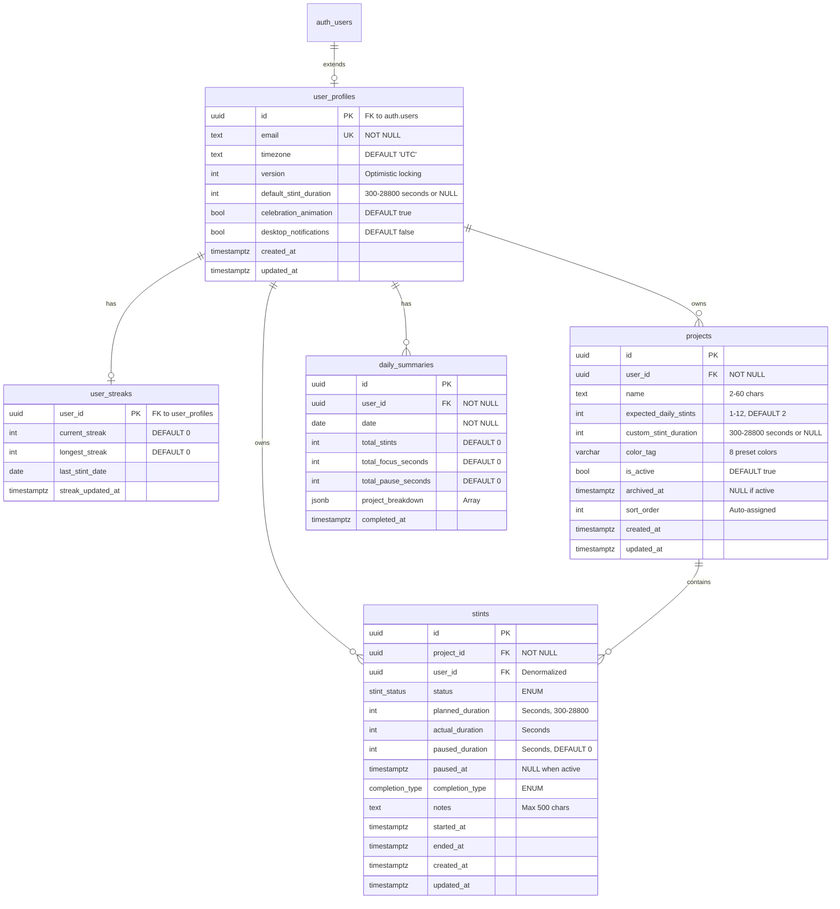
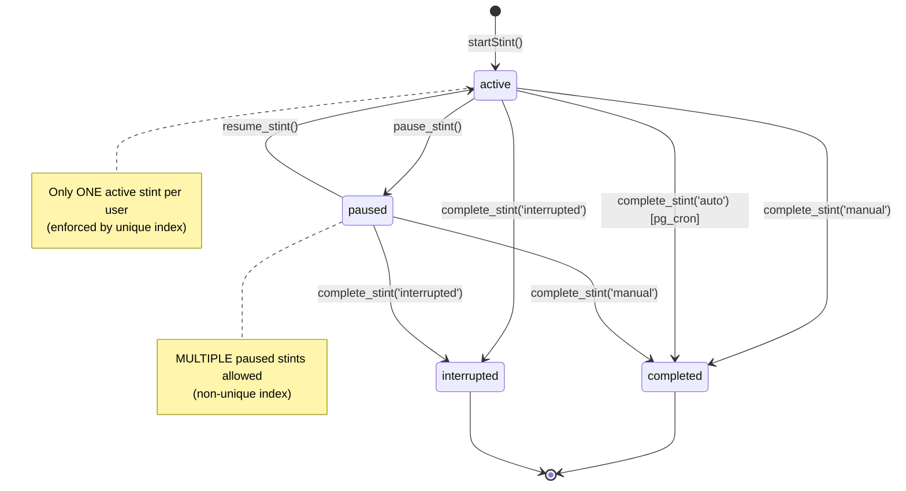
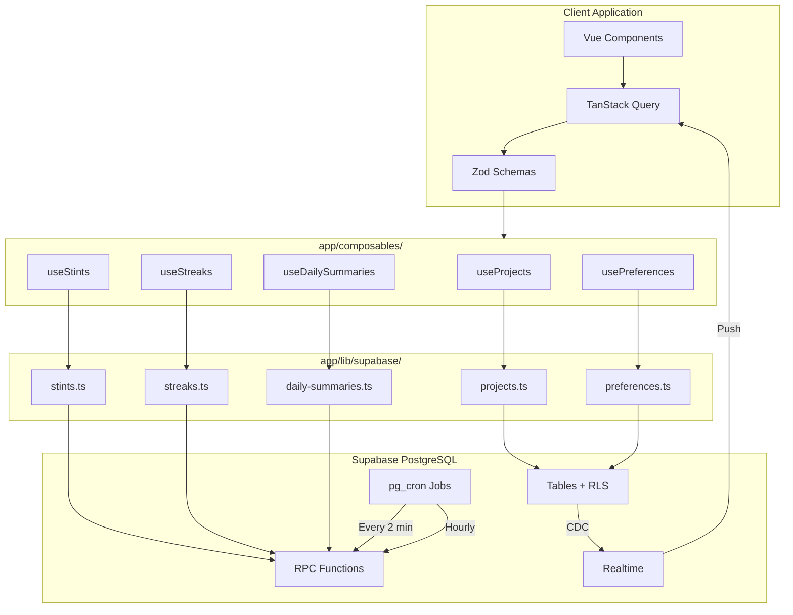

# LifeStint - Database Schema & Data Models

**Product Name:** LifeStint
**Document Version:** 5.1
**Date:** January 26, 2026

---

## Schema Version: 1.0

---

## Enum Types

The database uses PostgreSQL enum types for type-safe status tracking:

```sql
-- Stint status values
CREATE TYPE stint_status AS ENUM ('active', 'paused', 'completed', 'interrupted');

-- Stint completion type values
CREATE TYPE completion_type AS ENUM ('manual', 'auto', 'interrupted');
```

**Enum Descriptions:**
- `stint_status`: Tracks the lifecycle state of a work stint
  - `active`: Currently running (only one per user allowed)
  - `paused`: Temporarily stopped (multiple allowed per user)
  - `completed`: Successfully finished
  - `interrupted`: Manually cancelled before completion
- `completion_type`: How the stint ended
  - `manual`: User clicked stop
  - `auto`: Timer reached planned duration (pg_cron)
  - `interrupted`: User cancelled early

---

## User Profiles Table

> **Note:** This table extends Supabase's built-in `auth.users` table. User authentication (email/password, email verification, sessions) is handled by Supabase Auth. This `user_profiles` table stores application-specific profile data and user preferences.

```sql
CREATE TABLE user_profiles (
  id UUID REFERENCES auth.users(id) ON DELETE CASCADE PRIMARY KEY,
  email TEXT UNIQUE NOT NULL,
  timezone TEXT NOT NULL DEFAULT 'UTC',
  version INTEGER NOT NULL DEFAULT 1, -- Optimistic locking
  -- User preferences (stored here instead of separate table for simplicity)
  default_stint_duration INTEGER CHECK (default_stint_duration IS NULL OR (default_stint_duration >= 300 AND default_stint_duration <= 28800)),
  celebration_animation BOOLEAN NOT NULL DEFAULT true,
  desktop_notifications BOOLEAN NOT NULL DEFAULT false,
  created_at TIMESTAMPTZ DEFAULT now(),
  updated_at TIMESTAMPTZ DEFAULT now()
);

-- Indexes
CREATE INDEX idx_user_profiles_email ON user_profiles(email);
CREATE INDEX idx_user_profiles_timezone ON user_profiles(timezone);

-- RLS Policies
ALTER TABLE user_profiles ENABLE ROW LEVEL SECURITY;
CREATE POLICY "Users can view own profile" ON user_profiles FOR SELECT USING (auth.uid() = id);
CREATE POLICY "Users can update own profile" ON user_profiles FOR UPDATE USING (auth.uid() = id);
CREATE POLICY "Users can insert own profile" ON user_profiles FOR INSERT WITH CHECK (auth.uid() = id);

-- Trigger for updated_at
CREATE TRIGGER update_user_profiles_updated_at BEFORE UPDATE ON user_profiles
  FOR EACH ROW EXECUTE FUNCTION update_updated_at_column();

-- Auto-create profile and streak record on user signup
CREATE FUNCTION handle_new_user() RETURNS TRIGGER AS $$
BEGIN
  -- Create user profile
  INSERT INTO user_profiles (id, email, timezone, default_stint_duration, celebration_animation, desktop_notifications)
  VALUES (
    NEW.id,
    NEW.email,
    COALESCE(NEW.raw_user_meta_data->>'timezone', 'UTC'),
    NULL,  -- Use system default (120 min)
    true,  -- Celebration animation enabled
    false  -- Desktop notifications disabled by default
  )
  ON CONFLICT (id) DO NOTHING;

  -- Create user streaks record
  INSERT INTO user_streaks (user_id)
  VALUES (NEW.id)
  ON CONFLICT (user_id) DO NOTHING;

  RETURN NEW;
END;
$$ LANGUAGE plpgsql SECURITY DEFINER SET search_path = '';

CREATE TRIGGER on_auth_user_created
  AFTER INSERT ON auth.users
  FOR EACH ROW EXECUTE FUNCTION handle_new_user();
```

**Field Descriptions:**
- `id`: References `auth.users(id)` - the Supabase Auth user ID
- `email`: Synced from `auth.users.email` on profile creation
- `timezone`: IANA timezone string (e.g., "America/New_York") for daily reset and analytics
- `version`: Incremented on every update for optimistic locking (prevents race conditions)
- `default_stint_duration`: Default stint duration in seconds (300-28800). NULL means use system default (7200 seconds = 120 min)
- `celebration_animation`: Show confetti animation when daily goal is reached
- `desktop_notifications`: Enable browser notifications for stint completion

**Note on Preferences:**
- User preferences are stored directly in `user_profiles` rather than a separate table
- Theme preference is handled client-side via Nuxt color-mode (not stored in database)

**Note on Authentication:**
- Email verification is handled by Supabase Auth (`auth.users.email_confirmed_at`)

**Relationships:**
- One-to-many with `projects` (CASCADE on delete)
- One-to-many with `stints` (CASCADE on delete)
- One-to-one with `user_streaks` (CASCADE on delete)

---

## Projects Table

```sql
CREATE TABLE projects (
  id UUID PRIMARY KEY DEFAULT gen_random_uuid(),
  user_id UUID NOT NULL REFERENCES user_profiles(id) ON DELETE CASCADE,
  name TEXT NOT NULL,
  expected_daily_stints INTEGER NOT NULL DEFAULT 2,
  custom_stint_duration INTEGER, -- Seconds, NULL means use default (7200 seconds = 120 min)
  color_tag TEXT,
  is_active BOOLEAN NOT NULL DEFAULT true,
  archived_at TIMESTAMPTZ, -- NULL if not archived
  sort_order INTEGER NOT NULL DEFAULT 0,
  created_at TIMESTAMPTZ NOT NULL DEFAULT now(),
  updated_at TIMESTAMPTZ NOT NULL DEFAULT now(),
  CONSTRAINT valid_name CHECK (length(name) >= 2 AND length(name) <= 60),
  CONSTRAINT valid_daily_stints CHECK (expected_daily_stints >= 1 AND expected_daily_stints <= 12),
  CONSTRAINT valid_stint_duration CHECK (custom_stint_duration IS NULL OR
    (custom_stint_duration >= 300 AND custom_stint_duration <= 28800)),
  CONSTRAINT valid_color CHECK (color_tag IS NULL OR color_tag IN
    ('red', 'orange', 'amber', 'green', 'teal', 'blue', 'purple', 'pink'))
);

-- Case-insensitive unique project names per user
CREATE UNIQUE INDEX projects_name_user_id_lower_idx ON projects(user_id, LOWER(name));

-- Indexes
CREATE INDEX idx_projects_user_id ON projects(user_id);
CREATE INDEX idx_projects_user_active ON projects(user_id, is_active) WHERE archived_at IS NULL;
CREATE INDEX idx_projects_user_sort ON projects(user_id, sort_order);
CREATE INDEX idx_projects_archived ON projects(user_id, archived_at) WHERE archived_at IS NOT NULL;
CREATE INDEX idx_projects_not_archived ON projects(user_id, is_active, sort_order) WHERE archived_at IS NULL;

-- RLS Policies
ALTER TABLE projects ENABLE ROW LEVEL SECURITY;
CREATE POLICY "Users can view own projects" ON projects FOR SELECT USING (auth.uid() = user_id);
CREATE POLICY "Users can insert own projects" ON projects FOR INSERT WITH CHECK (auth.uid() = user_id);
CREATE POLICY "Users can update own projects" ON projects FOR UPDATE USING (auth.uid() = user_id);
CREATE POLICY "Users can delete own projects" ON projects FOR DELETE USING (auth.uid() = user_id);

-- Trigger for updated_at
CREATE TRIGGER set_projects_updated_at BEFORE UPDATE ON projects
  FOR EACH ROW EXECUTE FUNCTION update_updated_at_column();

-- Trigger for auto-assigning sort_order on insert
CREATE TRIGGER auto_assign_project_sort_order_trigger BEFORE INSERT ON projects
  FOR EACH ROW EXECUTE FUNCTION auto_assign_project_sort_order();
```

**Field Descriptions:**
- `custom_stint_duration`: Overrides default 7200 seconds (120 min) if set. Stored in seconds.
- `color_tag`: Visual identifier in dashboard (8 preset colors)
- `archived_at`: Soft delete timestamp (NULL if active)
- `sort_order`: User-defined ordering (0 = first), future drag-to-reorder

**Constraints:**
- Project names must be unique per user (case-insensitive)
- Expected daily stints: 1-12
- Custom stint duration: 300-28800 seconds (5-480 minutes) if specified

**Business Rules:**
- Archiving a project with active stint is prevented by application logic
- Archived projects excluded from daily totals and streak calculations

**Relationships:**
- Many-to-one with `user_profiles` (CASCADE on delete)
- One-to-many with `stints` (CASCADE on delete)

---

## Stints Table

```sql
CREATE TABLE stints (
  id UUID PRIMARY KEY DEFAULT gen_random_uuid(),
  project_id UUID NOT NULL REFERENCES projects(id) ON DELETE CASCADE,
  user_id UUID NOT NULL REFERENCES user_profiles(id) ON DELETE CASCADE, -- Denormalized for query performance
  started_at TIMESTAMPTZ NOT NULL DEFAULT now(),
  ended_at TIMESTAMPTZ,
  planned_duration INTEGER NOT NULL, -- Seconds (300-28800)
  actual_duration INTEGER, -- Seconds, calculated on completion
  paused_duration INTEGER NOT NULL DEFAULT 0, -- Seconds
  paused_at TIMESTAMPTZ, -- Most recent pause time
  status stint_status NOT NULL DEFAULT 'active', -- Uses enum type
  completion_type completion_type, -- Uses enum type
  notes TEXT,
  created_at TIMESTAMPTZ NOT NULL DEFAULT now(),
  updated_at TIMESTAMPTZ NOT NULL DEFAULT now(),
  CONSTRAINT valid_planned_duration CHECK (planned_duration >= 300 AND planned_duration <= 28800),
  CONSTRAINT valid_notes CHECK (notes IS NULL OR length(notes) <= 500),
  CONSTRAINT valid_ended CHECK (ended_at IS NULL OR ended_at >= started_at),
  CONSTRAINT completed_has_ended CHECK (status IN ('active', 'paused') OR ended_at IS NOT NULL)
);

-- Indexes
CREATE INDEX idx_stints_project_id ON stints(project_id);
CREATE INDEX idx_stints_user_date ON stints(user_id, started_at DESC);
CREATE INDEX idx_stints_project_date ON stints(project_id, started_at DESC);
CREATE INDEX idx_stints_started_at ON stints(started_at);
CREATE INDEX idx_stints_status_started ON stints(status, started_at) WHERE status = 'active';
CREATE INDEX idx_stints_user_status ON stints(user_id, status) WHERE status IN ('active', 'paused');

-- Enforces single active stint per user
CREATE UNIQUE INDEX idx_stints_single_active_per_user ON stints(user_id) WHERE status = 'active';

-- Non-unique index for paused stints (multiple allowed)
CREATE INDEX idx_stints_paused_per_user ON stints(user_id) WHERE status = 'paused';

-- RLS Policies
ALTER TABLE stints ENABLE ROW LEVEL SECURITY;
CREATE POLICY "Users can view own stints" ON stints FOR SELECT USING (auth.uid() = user_id);
CREATE POLICY "Users can insert own stints" ON stints FOR INSERT
  WITH CHECK (auth.uid() = user_id AND EXISTS (SELECT 1 FROM projects WHERE id = project_id AND user_id = auth.uid()));
CREATE POLICY "Users can update own stints" ON stints FOR UPDATE USING (auth.uid() = user_id);
CREATE POLICY "Users can delete own stints" ON stints FOR DELETE USING (auth.uid() = user_id);

-- Trigger for updated_at
CREATE TRIGGER update_stints_updated_at BEFORE UPDATE ON stints
  FOR EACH ROW EXECUTE FUNCTION update_updated_at_column();

-- Trigger for optimistic locking
CREATE TRIGGER increment_version_on_stint_change
  AFTER INSERT OR UPDATE OF status ON stints
  FOR EACH ROW
  WHEN (NEW.status IN ('active', 'paused'))
  EXECUTE FUNCTION trigger_increment_user_version_on_stint_change();

-- Realtime support
ALTER TABLE stints REPLICA IDENTITY FULL;
```

**Field Descriptions:**
- `user_id`: Denormalized for faster queries (no join needed)
- `planned_duration`: Stint length in **seconds** (300-28800). All duration fields now use seconds for consistency.
- `actual_duration`: Total working time in **seconds**, calculated on completion
- `paused_duration`: Cumulative pause time in **seconds**
- `status`: Uses `stint_status` enum (active, paused, completed, interrupted)
- `completion_type`: Uses `completion_type` enum (manual, auto, interrupted)
- `paused_at`: Timestamp when current pause started; NULL when active or completed

**Constraints:**
- Planned duration: 300-28800 seconds (5-480 minutes)
- Notes: Max 500 characters
- Completed/interrupted stints must have `ended_at`

**Business Rules:**
- Only one **active** stint per user (enforced by unique partial index `idx_stints_single_active_per_user`)
- **Multiple paused stints allowed** per user (non-unique index `idx_stints_paused_per_user`)
- Auto-completion triggered by pg_cron when working time reaches planned duration (active stints only)
- Working time (seconds): `EXTRACT(EPOCH FROM (now() - started_at)) - paused_duration`
- Comparison: `working_time_seconds >= planned_duration` (both in seconds)
- Paused stints do not auto-complete; working time is frozen while paused
- Interrupted stints don't count toward daily progress but preserved in history

**Realtime:**
- Table has `REPLICA IDENTITY FULL` for Supabase Realtime change data capture
- Added to `supabase_realtime` publication for real-time sync across devices

**Relationships:**
- Many-to-one with `projects` (CASCADE on delete)
- Many-to-one with `user_profiles` (CASCADE on delete)

---

## Daily Summaries Table

Pre-aggregated daily statistics for fast analytics queries.

```sql
CREATE TABLE daily_summaries (
  id UUID PRIMARY KEY DEFAULT gen_random_uuid(),
  user_id UUID NOT NULL REFERENCES user_profiles(id) ON DELETE CASCADE,
  date DATE NOT NULL, -- Calendar date in user's timezone
  total_stints INTEGER NOT NULL DEFAULT 0,
  total_focus_seconds INTEGER NOT NULL DEFAULT 0,
  total_pause_seconds INTEGER NOT NULL DEFAULT 0,
  project_breakdown JSONB NOT NULL DEFAULT '[]'::jsonb,
  completed_at TIMESTAMPTZ NOT NULL DEFAULT now(),
  CONSTRAINT unique_user_date UNIQUE (user_id, date),
  CONSTRAINT total_stints_non_negative CHECK (total_stints >= 0),
  CONSTRAINT total_focus_seconds_non_negative CHECK (total_focus_seconds >= 0),
  CONSTRAINT total_pause_seconds_non_negative CHECK (total_pause_seconds >= 0)
);

-- Indexes
CREATE INDEX idx_daily_summaries_user_date ON daily_summaries(user_id, date DESC);
CREATE INDEX idx_daily_summaries_date ON daily_summaries(date DESC);

-- RLS Policy
ALTER TABLE daily_summaries ENABLE ROW LEVEL SECURITY;
CREATE POLICY "Users can read own summaries" ON daily_summaries FOR SELECT USING (auth.uid() = user_id);
-- No INSERT/UPDATE policies: only pg_cron with service role can write

-- Realtime support
ALTER TABLE daily_summaries REPLICA IDENTITY FULL;
```

**Field Descriptions:**
- `date`: Calendar date in the user's timezone
- `project_breakdown`: JSONB array containing per-project stats:
  ```json
  [
    {"project_id": "uuid", "project_name": "Client A", "stint_count": 3, "focus_seconds": 7200},
    {"project_id": "uuid", "project_name": "Client B", "stint_count": 1, "focus_seconds": 3600}
  ]
  ```

**Purpose:**
- Pre-aggregates daily stats for fast analytics queries
- Avoids expensive SUM() queries on stints table for every page load
- Generated by `process_daily_reset()` cron job (hourly)
- Supports real-time sync across devices

**Relationships:**
- Many-to-one with `user_profiles` (CASCADE on delete)

---

## Streak Tracking Table

Tracks user work streaks with timezone-aware calculations.

```sql
CREATE TABLE user_streaks (
  user_id UUID PRIMARY KEY REFERENCES user_profiles(id) ON DELETE CASCADE,
  current_streak INTEGER NOT NULL DEFAULT 0,
  longest_streak INTEGER NOT NULL DEFAULT 0,
  last_stint_date DATE,
  streak_updated_at TIMESTAMPTZ NOT NULL DEFAULT now()
);

-- Indexes
CREATE INDEX idx_user_streaks_user_id ON user_streaks(user_id);

-- RLS Policies
ALTER TABLE user_streaks ENABLE ROW LEVEL SECURITY;
CREATE POLICY "Users can read own streaks" ON user_streaks FOR SELECT USING (auth.uid() = user_id);
CREATE POLICY "Users can insert own streaks" ON user_streaks FOR INSERT WITH CHECK (auth.uid() = user_id);
CREATE POLICY "Users can update own streaks" ON user_streaks FOR UPDATE USING (auth.uid() = user_id);
```

**Field Descriptions:**
- `current_streak`: Number of consecutive days with completed stints
- `longest_streak`: All-time longest streak (never decreases)
- `last_stint_date`: Date of most recent completed stint (in user's timezone)
- `streak_updated_at`: When streak was last recalculated

**Business Rules:**
- Streaks use a **1-day grace period**: missing today doesn't break the streak until tomorrow
- Calculated via `calculate_streak_with_tz()` function with timezone support
- Updated automatically by `process_daily_reset()` cron job
- Record created automatically via `handle_new_user()` trigger

**Relationships:**
- One-to-one with `user_profiles` (CASCADE on delete)

---

## Audit Log Table (Future)

> **Note:** This table is planned for a future release for support and debugging purposes.

```sql
CREATE TABLE audit_logs (
  id UUID PRIMARY KEY DEFAULT gen_random_uuid(),
  user_id UUID REFERENCES user_profiles(id) ON DELETE SET NULL,
  action TEXT NOT NULL,
  entity_type TEXT NOT NULL, -- 'project', 'stint', 'user_preferences'
  entity_id UUID,
  old_values JSONB,
  new_values JSONB,
  ip_address INET,
  user_agent TEXT,
  created_at TIMESTAMPTZ NOT NULL DEFAULT now()
);

-- Indexes
CREATE INDEX idx_audit_logs_user ON audit_logs(user_id, created_at DESC);
CREATE INDEX idx_audit_logs_entity ON audit_logs(entity_type, entity_id);

-- No RLS (internal only, accessed via pg_cron jobs with service role)
```

**Purpose:**
- Track user actions for support investigations
- Debug stint conflicts and data inconsistencies
- Not exposed to users (internal only)

**Retention:**
- 90 days (cleanup via scheduled task)

---

## Scheduled Jobs (pg_cron)

The database uses pg_cron for background task scheduling.

```sql
-- Enable pg_cron extension
CREATE EXTENSION IF NOT EXISTS pg_cron;
```

### Auto-Complete Stints Job

Automatically completes stints that have exceeded their planned duration.

```sql
-- Runs every 1 minute (pg_cron minimum interval)
SELECT cron.schedule(
  'auto-complete-stints',
  '* * * * *',
  $$SELECT auto_complete_expired_stints()$$
);
```

**Purpose:**
- Finds all active stints where `working_time >= planned_duration` (both in seconds)
- Calls `complete_stint()` with `completion_type = 'auto'`
- Returns count of completed stints and any errors

### Daily Reset Job

Aggregates daily summaries and updates streaks for users at their local midnight.

```sql
-- Runs every hour at :00
SELECT cron.schedule(
  'daily-reset-job',
  '0 * * * *',
  $$SELECT process_daily_reset()$$
);
```

**Purpose:**
- Finds users where current hour in their timezone = 0 (midnight)
- Calls `aggregate_daily_summary()` for yesterday's data
- Calls `update_user_streak()` to recalculate streaks
- Returns count of users processed, summaries created, and errors

**Note:** Jobs run with service role privileges, bypassing RLS.

---

## Realtime Support

Tables configured for Supabase Realtime change data capture:

```sql
-- Enable Realtime for stints and daily_summaries
ALTER TABLE stints REPLICA IDENTITY FULL;
ALTER TABLE daily_summaries REPLICA IDENTITY FULL;

-- Add to Realtime publication
ALTER PUBLICATION supabase_realtime ADD TABLE stints;
ALTER PUBLICATION supabase_realtime ADD TABLE daily_summaries;
```

**Usage:**
- Client subscribes to user-specific changes using RLS filters
- Enables real-time sync across multiple devices
- Changes broadcast via WebSocket

---

## RLS Notes

> **Note:** RLS policies are defined inline with each table definition above. This section provides additional context.

### Service Role Bypass

- pg_cron jobs run with service role privileges (bypasses RLS)
- Used for:
  - Auto-completing stints (scheduled job)
  - Generating daily summaries (scheduled job)
  - System maintenance operations
- Service role never exposed to frontend (only used server-side by pg_cron)

### Testing RLS

```sql
-- Test as user
SET LOCAL ROLE authenticated;
SET LOCAL request.jwt.claims.sub = 'user-uuid-here';

-- Attempt to read another user's data (should return 0 rows)
SELECT * FROM projects WHERE user_id != 'user-uuid-here';

-- Attempt to insert with wrong user_id (should fail)
INSERT INTO projects (user_id, name) VALUES ('other-user-uuid', 'Test');
```

### RLS Summary Table

| Table | SELECT | INSERT | UPDATE | DELETE |
|-------|--------|--------|--------|--------|
| user_profiles | Own only | Own only | Own only | N/A |
| projects | Own only | Own only | Own only | Own only |
| stints | Own only | Own + project ownership | Own only | Own only |
| user_streaks | Own only | Own only | Own only | N/A |
| daily_summaries | Own only | N/A (cron) | N/A (cron) | N/A |

---

## Database Functions

### Utility Functions

**update_updated_at_column()**
- Automatically updates `updated_at` timestamp on row updates
- Used by triggers on all tables with `updated_at` field
- Security: `SET search_path = ''` to prevent search path injection

**calculate_actual_duration(p_started_at, p_ended_at, p_paused_duration)**
- Calculates actual working time in seconds
- Formula: `EXTRACT(EPOCH FROM (p_ended_at - p_started_at)) - p_paused_duration`
- IMMUTABLE function for use in computed columns

**increment_user_version(p_user_id UUID)**
- Increments `user_profiles.version` for optimistic locking
- Returns new version number
- SECURITY DEFINER

**auto_assign_project_sort_order()**
- Trigger function for auto-assigning `sort_order` on project insert
- Calculates `MAX(sort_order) + 1` for user's projects

### Stint Lifecycle Functions

**validate_stint_start(p_project_id UUID, p_version INTEGER)**
- Pre-start validation with advisory lock for race condition prevention
- Checks user version (optimistic locking)
- Returns: `can_start`, `existing_stint_id`, `existing_stint_status`, `existing_project_name`, `conflict_message`
- SECURITY DEFINER

**get_active_stint(p_user_id UUID)**
- Returns the **active** stint only (status = 'active', not paused)
- STABLE, SECURITY DEFINER, LIMIT 1

**pause_stint(p_stint_id UUID)**
- Sets status to 'paused' and records `paused_at`
- Validates ownership via `auth.uid()`
- Returns updated stint row
- SECURITY DEFINER

**resume_stint(p_stint_id UUID)**
- Resumes a paused stint (status → 'active')
- Checks for existing active stint (conflict)
- Accumulates `paused_duration`
- Returns updated stint row
- SECURITY DEFINER

**complete_stint(p_stint_id UUID, p_completion_type TEXT, p_notes TEXT)**
- Completes a stint by calculating actual duration
- **Idempotent**: returns existing stint if already completed/interrupted
- Validates ownership via `auth.uid()`
- Returns completed stint row
- SECURITY DEFINER

### Streak Functions

**calculate_streak_with_tz(p_user_id UUID, p_timezone TEXT DEFAULT 'UTC')**
- Timezone-aware streak calculation
- Returns: `current_streak`, `longest_streak`, `last_stint_date`, `is_at_risk`
- `is_at_risk = true` when last stint was yesterday (grace period)
- STABLE, SECURITY DEFINER

**calculate_streak(p_user_id UUID)**
- Backward-compatible wrapper for `calculate_streak_with_tz` using UTC
- Returns: INTEGER (current streak only)
- STABLE, SECURITY DEFINER

**update_user_streak(p_user_id UUID, p_timezone TEXT DEFAULT 'UTC')**
- Calls `calculate_streak_with_tz` and upserts into `user_streaks`
- Returns: `current_streak`, `longest_streak`, `last_stint_date`, `is_at_risk`
- SECURITY DEFINER

### Daily Summary Functions

**aggregate_daily_summary(p_user_id UUID, p_date DATE)**
- Aggregates completed stints for a specific user and date
- Uses UPSERT for idempotency
- NOT callable by authenticated users (security revoked)
- Only callable by service role (pg_cron)
- SECURITY DEFINER

**process_daily_reset()**
- Orchestrates daily reset for all users at their local midnight
- Finds users where current hour in timezone = 0
- Calls `aggregate_daily_summary` and `update_user_streak`
- Returns: `users_processed`, `summaries_created`, `streaks_updated`, `errors`
- SECURITY DEFINER

**get_daily_summaries(p_user_id UUID, p_start_date DATE, p_end_date DATE)**
- Client-facing query for date range summaries
- Returns pre-aggregated data for past dates
- Returns **live-calculated data for today** (not from table)
- Uses deterministic UUID v5 for live row
- SECURITY INVOKER (RLS applies)

### Auto-Completion Functions

**auto_complete_expired_stints()**
- Called by pg_cron every 1 minute
- Finds all active stints past planned duration
- Calls `complete_stint` for each expired stint
- Returns: `completed_count`, `error_count`, `completed_stint_ids`
- SECURITY DEFINER

### Project Functions

**count_active_projects(p_user_id UUID)**
- Returns count of active (non-archived) projects
- STABLE

---

## Indexes Summary

### User Profiles Indexes
| Index | Columns | Type | Purpose |
|-------|---------|------|---------|
| `idx_user_profiles_email` | email | B-tree | Fast user lookup by email |
| `idx_user_profiles_timezone` | timezone | B-tree | Group users by timezone for cron |

### Projects Indexes
| Index | Columns | Type | Purpose |
|-------|---------|------|---------|
| `idx_projects_user_id` | user_id | B-tree | User's projects lookup |
| `idx_projects_user_active` | user_id, is_active | Partial | Active projects (WHERE archived_at IS NULL) |
| `idx_projects_user_sort` | user_id, sort_order | B-tree | Sorted project list |
| `idx_projects_archived` | user_id, archived_at | Partial | Archived projects (WHERE archived_at IS NOT NULL) |
| `idx_projects_not_archived` | user_id, is_active, sort_order | Partial | Non-archived (WHERE archived_at IS NULL) |
| `projects_name_user_id_lower_idx` | user_id, LOWER(name) | Unique | Case-insensitive name uniqueness |

### Stints Indexes
| Index | Columns | Type | Purpose |
|-------|---------|------|---------|
| `idx_stints_project_id` | project_id | B-tree | Project's stints lookup |
| `idx_stints_user_date` | user_id, started_at DESC | B-tree | User's stint history |
| `idx_stints_project_date` | project_id, started_at DESC | B-tree | Project stint history |
| `idx_stints_started_at` | started_at | B-tree | Time-based queries |
| `idx_stints_status_started` | status, started_at | Partial | Active stints (WHERE status = 'active') |
| `idx_stints_user_status` | user_id, status | Partial | User's active/paused (WHERE status IN (...)) |
| `idx_stints_single_active_per_user` | user_id | Unique partial | **One active stint per user** (WHERE status = 'active') |
| `idx_stints_paused_per_user` | user_id | Partial | Paused stints (WHERE status = 'paused') |

### Daily Summaries Indexes
| Index | Columns | Type | Purpose |
|-------|---------|------|---------|
| `idx_daily_summaries_user_date` | user_id, date DESC | B-tree | User's daily history |
| `idx_daily_summaries_date` | date DESC | B-tree | Date-based aggregation |

### User Streaks Indexes
| Index | Columns | Type | Purpose |
|-------|---------|------|---------|
| `idx_user_streaks_user_id` | user_id | B-tree | User lookup |

---

## Entity Relationship Diagram



---

## Stint Lifecycle State Machine



---

## Data Flow Diagram



---

**Related Documents:**
- [04-technical-architecture.md](./04-technical-architecture.md) - Technical architecture context
- [06-implementation-guide.md](./06-implementation-guide.md) - Implementation details using this schema
- [09-operations-compliance.md](./09-operations-compliance.md) - Database migration strategy

