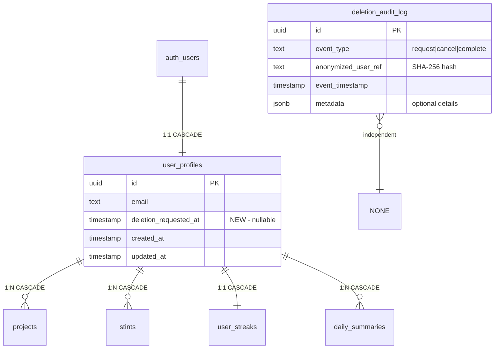

# Data Model: Account Deletion Backend

**Feature Branch**: `007-account-deletion-backend`
**Date**: 2026-02-03

## Entity Overview



## Entity Definitions

### 1. user_profiles (Modified)

**Change**: Add `deletion_requested_at` column

| Column | Type | Nullable | Default | Description |
|--------|------|----------|---------|-------------|
| `deletion_requested_at` | `TIMESTAMP WITH TIME ZONE` | YES | `NULL` | When deletion was requested; NULL = not pending |

**Validation Rules**:
- If `deletion_requested_at` is NOT NULL, user has pending deletion
- Grace period: 30 days from `deletion_requested_at`
- Permanent deletion eligible when: `deletion_requested_at + INTERVAL '30 days' < NOW()`

**State Transitions**:
```
Normal Account ──[request deletion]──► Pending Deletion
     ▲                                       │
     │                                       │
     └────────[cancel deletion]──────────────┘
                                             │
                              [30 days expire]
                                             │
                                             ▼
                                    Permanently Deleted
```

### 2. deletion_audit_log (New Table)

**Purpose**: GDPR compliance - permanent record of deletion events with anonymized references

| Column | Type | Nullable | Default | Description |
|--------|------|----------|---------|-------------|
| `id` | `UUID` | NO | `gen_random_uuid()` | Primary key |
| `event_type` | `TEXT` | NO | - | One of: 'request', 'cancel', 'complete' |
| `anonymized_user_ref` | `TEXT` | NO | - | SHA-256 hash of original user_id |
| `event_timestamp` | `TIMESTAMP WITH TIME ZONE` | NO | `NOW()` | When event occurred |
| `metadata` | `JSONB` | YES | `NULL` | Optional context (email hash, IP hash) |

**Constraints**:
- `CHECK (event_type IN ('request', 'cancel', 'complete'))`
- No foreign key to user tables (must survive user deletion)
- No RLS (admin/service access only via SECURITY DEFINER functions)

**Indexes**:
- `idx_deletion_audit_anonymized_ref` on `anonymized_user_ref` (for compliance lookups)
- `idx_deletion_audit_timestamp` on `event_timestamp` (for time-based queries)

### 3. Related Entities (Existing - No Changes)

These entities are automatically handled by existing CASCADE DELETE constraints:

| Entity | FK Column | Cascade Behavior |
|--------|-----------|------------------|
| `projects` | `user_id → user_profiles(id)` | Deleted when user deleted |
| `stints` | `user_id → user_profiles(id)` | Deleted when user deleted |
| `stints` | `project_id → projects(id)` | Deleted when project deleted |
| `user_streaks` | `user_id → user_profiles(id)` | Deleted when user deleted |
| `daily_summaries` | `user_id → user_profiles(id)` | Deleted when user deleted |

## API Types (TypeScript)

### Request/Response Types

```typescript
// Deletion status returned to client
interface DeletionStatus {
  isPending: boolean
  requestedAt: string | null      // ISO timestamp
  expiresAt: string | null        // ISO timestamp (requestedAt + 30 days)
  daysRemaining: number | null    // Countdown for UI
}

// Payload for requesting deletion
interface RequestDeletionPayload {
  email: string      // Must match current user's email
  password: string   // Re-authentication requirement
}

// Payload for canceling deletion (no confirmation needed)
interface CancelDeletionPayload {
  // Empty - just needs authenticated user
}

// Audit log entry (internal, not exposed to client)
interface DeletionAuditEntry {
  id: string
  eventType: 'request' | 'cancel' | 'complete'
  anonymizedUserRef: string
  eventTimestamp: string
  metadata: Record<string, unknown> | null
}
```

### Database Row Types (Generated)

After migration, `npm run supabase:types` will generate:

```typescript
// In database.types.ts (auto-generated)
interface Database {
  public: {
    Tables: {
      user_profiles: {
        Row: {
          // ... existing fields
          deletion_requested_at: string | null  // NEW
        }
        Insert: {
          // ... existing fields
          deletion_requested_at?: string | null  // NEW, optional
        }
        Update: {
          // ... existing fields
          deletion_requested_at?: string | null  // NEW, optional
        }
      }
      deletion_audit_log: {
        Row: {
          id: string
          event_type: string
          anonymized_user_ref: string
          event_timestamp: string
          metadata: Json | null
        }
        Insert: {
          id?: string
          event_type: string
          anonymized_user_ref: string
          event_timestamp?: string
          metadata?: Json | null
        }
        Update: {
          // Generally not updated, but for completeness
          event_type?: string
          metadata?: Json | null
        }
      }
    }
  }
}
```

## Validation Rules (Zod Schemas)

### Request Deletion Schema

```typescript
import { z } from 'zod'

export const requestDeletionSchema = z.object({
  email: z
    .string()
    .email('Please enter a valid email address')
    .min(1, 'Email is required'),
  password: z
    .string()
    .min(1, 'Password is required'),
})

export type RequestDeletionPayload = z.infer<typeof requestDeletionSchema>
```

### Deletion Status Schema

```typescript
export const deletionStatusSchema = z.object({
  isPending: z.boolean(),
  requestedAt: z.string().nullable(),
  expiresAt: z.string().nullable(),
  daysRemaining: z.number().int().nullable(),
})

export type DeletionStatus = z.infer<typeof deletionStatusSchema>
```

## Business Rules

### BR-001: Active Stint Blocks Deletion

**Rule**: User cannot request deletion while an active (running) stint exists

**Implementation**:
```sql
-- Check before allowing deletion request
SELECT EXISTS (
  SELECT 1 FROM stints
  WHERE user_id = $user_id
    AND started_at IS NOT NULL
    AND completed_at IS NULL
    AND paused_at IS NULL
) AS has_active_stint
```

**Error Message**: "Please end your active stint before requesting account deletion"

### BR-002: Email Must Match Authenticated User

**Rule**: Provided email must exactly match the authenticated user's email

**Implementation**: Compare `payload.email` with `user.email` from auth session

**Error Message**: "The email address does not match your account"

### BR-003: Password Must Be Valid

**Rule**: Provided password must successfully authenticate

**Implementation**: Call `signInWithPassword({ email, password })` - if error, reject

**Error Message**: "Incorrect password"

### BR-004: Only One Active Deletion Request

**Rule**: User cannot request deletion if already pending

**Implementation**: Check `deletion_requested_at IS NOT NULL`

**Error Message**: "Account deletion is already scheduled. You can cancel it from Settings."

### BR-005: Cancellation Only During Grace Period

**Rule**: Deletion can only be canceled while `deletion_requested_at` is set

**Implementation**: Check `deletion_requested_at IS NOT NULL` before allowing cancel

**Error Message**: "No pending deletion request to cancel"

### BR-006: Grace Period Calculation

**Rule**: Permanent deletion eligible 30 days after request

**Calculation**:
```sql
deletion_requested_at + INTERVAL '30 days' < NOW()
```

**Always use UTC** for timestamp comparisons.

## Migration Plan

### Migration 1: Add deletion_requested_at column

```sql
-- Add nullable column to user_profiles
ALTER TABLE public.user_profiles
ADD COLUMN deletion_requested_at TIMESTAMP WITH TIME ZONE DEFAULT NULL;

-- Index for finding pending deletions efficiently
CREATE INDEX idx_user_profiles_deletion_pending
ON public.user_profiles (deletion_requested_at)
WHERE deletion_requested_at IS NOT NULL;
```

### Migration 2: Create deletion_audit_log table

```sql
CREATE TABLE public.deletion_audit_log (
  id UUID PRIMARY KEY DEFAULT gen_random_uuid(),
  event_type TEXT NOT NULL CHECK (event_type IN ('request', 'cancel', 'complete')),
  anonymized_user_ref TEXT NOT NULL,
  event_timestamp TIMESTAMP WITH TIME ZONE NOT NULL DEFAULT NOW(),
  metadata JSONB DEFAULT NULL
);

-- No RLS - accessed only via SECURITY DEFINER functions
ALTER TABLE public.deletion_audit_log ENABLE ROW LEVEL SECURITY;

-- No policies = no direct access
-- Access only through functions with SECURITY DEFINER

-- Indexes for compliance queries
CREATE INDEX idx_deletion_audit_anonymized_ref
ON public.deletion_audit_log (anonymized_user_ref);

CREATE INDEX idx_deletion_audit_timestamp
ON public.deletion_audit_log (event_timestamp);
```

### Migration 3: Helper functions

```sql
-- Function to generate anonymized user reference
CREATE OR REPLACE FUNCTION generate_anonymized_user_ref(user_id UUID)
RETURNS TEXT
LANGUAGE sql
IMMUTABLE
AS $$
  SELECT encode(sha256(user_id::text::bytea), 'hex')
$$;

-- Function to log deletion event (SECURITY DEFINER)
CREATE OR REPLACE FUNCTION log_deletion_event(
  p_user_id UUID,
  p_event_type TEXT,
  p_metadata JSONB DEFAULT NULL
)
RETURNS UUID
LANGUAGE plpgsql
SECURITY DEFINER
SET search_path = ''
AS $$
DECLARE
  v_log_id UUID;
BEGIN
  INSERT INTO public.deletion_audit_log (
    event_type,
    anonymized_user_ref,
    metadata
  ) VALUES (
    p_event_type,
    public.generate_anonymized_user_ref(p_user_id),
    p_metadata
  )
  RETURNING id INTO v_log_id;

  RETURN v_log_id;
END;
$$;

GRANT EXECUTE ON FUNCTION log_deletion_event TO authenticated;
```
