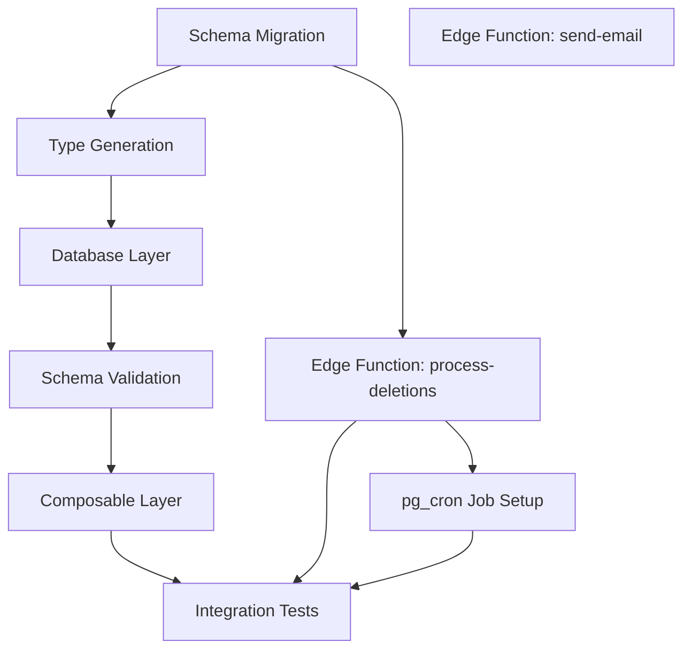

# Research: Account Deletion Backend

**Feature Branch**: `007-account-deletion-backend`
**Research Date**: 2026-02-03
**Status**: Complete

## Architectural Fit Analysis

### Existing Patterns to Follow

| Pattern | Location | How It Applies |
|---------|----------|----------------|
| Three-Layer Data Access | `app/lib/supabase/`, `app/schemas/`, `app/composables/` | Create parallel files for account deletion |
| Result<T> Return Type | `app/lib/supabase/auth.ts` | All deletion functions return `{ data, error }` |
| requireUserId() | `app/lib/supabase/auth.ts` | Verify authenticated user before deletion ops |
| TanStack Query Mutations | `app/composables/usePreferences.ts` | Optimistic updates with rollback |
| Query Key Factory | `app/composables/useProjects.ts` | Create `accountDeletionKeys` factory |
| pg_cron Jobs | `supabase/migrations/20251217012244_schedule_daily_reset_cron.sql` | Similar pattern for cleanup job |
| SECURITY DEFINER Functions | `supabase/migrations/20251217012243_create_daily_reset_functions.sql` | For system-level deletion operations |
| Structured Logging | `app/utils/logger.ts` | Log deletion events with `createLogger('account-deletion')` |
| Toast Notifications | `app/pages/settings.vue` | Existing pattern for success/error feedback |

### New Patterns Required

| Pattern | Justification |
|---------|---------------|
| Edge Function for Auth Admin | `admin.deleteUser()` requires SERVICE_ROLE key, cannot be exposed client-side |
| Audit Log Table | GDPR compliance requires permanent record with anonymized references |
| Email via Resend | No email infrastructure exists; Resend is well-documented with Supabase |
| pg_net for Edge Function calls | pg_cron can't call Edge Functions directly, needs HTTP extension |

## Technical Decisions

### Decision 1: Password Verification Method

**Decision**: Use `signInWithPassword()` client-side to verify credentials

**Rationale**:
- Supabase Auth already handles password verification securely
- No new infrastructure required
- Can verify without creating a new session (just check for error)
- Follows principle of using existing capabilities

**Alternatives Considered**:
| Alternative | Rejected Because |
|-------------|------------------|
| Edge Function for password check | Adds complexity, Supabase Auth already does this |
| Custom password hash comparison | Security risk, reinventing the wheel |
| Email-only confirmation | Spec requires password (FR-002) |

### Decision 2: Deletion Execution Architecture

**Decision**: Edge Function `process-account-deletions` invoked by pg_cron via pg_net

**Rationale**:
- `auth.admin.deleteUser()` requires SERVICE_ROLE key
- SERVICE_ROLE key must never be exposed to client
- Edge Functions have secure access to environment secrets
- pg_cron provides reliable scheduling (already used for daily reset)

**Alternatives Considered**:
| Alternative | Rejected Because |
|-------------|------------------|
| Client-side with service role | CRITICAL security risk - key exposure |
| PostgreSQL function only | Cannot make HTTP calls to Auth API |
| External cron service | Adds infrastructure complexity |

### Decision 3: Data Deletion Strategy

**Decision**: Hard delete via CASCADE constraints + `auth.admin.deleteUser()`

**Rationale**:
- Spec explicitly requires hard delete (FR-008)
- CASCADE foreign keys already exist on all user-owned tables
- Deleting from `auth.users` cascades to `user_profiles`, then to all related data
- GDPR Article 17 compliance (right to erasure)

**Deletion Chain**:
```
auth.users (deleted by admin.deleteUser)
└── CASCADE → user_profiles
    ├── CASCADE → projects
    │   └── CASCADE → stints
    ├── CASCADE → stints (direct FK)
    ├── CASCADE → user_streaks
    └── CASCADE → daily_summaries
```

### Decision 4: Email Infrastructure

**Decision**: Resend API via Edge Function

**Rationale**:
- No existing email infrastructure in project
- Resend has excellent Supabase documentation
- Simple REST API, no complex SMTP setup
- Spec allows email failures to not block deletion request (FR-003)

**Email Events**:
1. Deletion request confirmation (FR-003)
2. 7-day warning before permanent deletion (FR-014)

### Decision 5: Audit Log Design

**Decision**: Separate `deletion_audit_log` table with anonymized user references

**Rationale**:
- Must retain audit trail indefinitely (FR-010)
- Cannot contain actual user_id after deletion (GDPR)
- Use SHA-256 hash of user_id for anonymized reference
- Timestamps provide compliance evidence

### Decision 6: Reminder Email Architecture

**Decision**: Embed reminder logic as Phase 2 of the `process-account-deletions` Edge Function

**Rationale**:
- FR-014 requires 7-day reminder emails before permanent deletion
- FR-014 also requires that reminder failures must NOT block or delay deletions
- Running deletions (Phase 1) before reminders (Phase 2) in the same Edge Function satisfies both requirements
- Reuses the existing `send-deletion-email` Edge Function (type: `deletion_reminder`)
- Single pg_cron job instead of two — simpler operational footprint

**Alternatives Considered**:
| Alternative | Rejected Because |
|-------------|------------------|
| Separate pg_cron job for reminders | Adds operational complexity for little benefit |
| Separate Edge Function for reminders | Code duplication; same queries needed |
| Client-side reminder scheduling | Not possible — users may not log in near the 7-day window |

**Timing Logic**:
- Query users where `deletion_requested_at + INTERVAL '23 days' < NOW() AND deletion_requested_at + INTERVAL '24 days' > NOW()`
- This window ensures each user receives exactly one reminder (daily cron covers the 24h window)
- Users who canceled before day 23 have `deletion_requested_at = NULL` and are automatically excluded

## Dependencies

### Technical Dependencies

| Dependency | Version | Purpose | Status |
|------------|---------|---------|--------|
| @supabase/supabase-js | existing | Auth API, database operations | ✅ Available |
| pg_cron | existing | Scheduled cleanup job | ✅ Enabled |
| pg_net | TBD | HTTP calls from PostgreSQL | ⚠️ Needs verification |
| Resend | npm:resend | Email delivery | 🆕 New dependency |

### Task Dependencies



### External Service Dependencies

| Service | Required For | Fallback |
|---------|--------------|----------|
| Supabase Auth | User deletion | None (core requirement) |
| Resend | Email notifications | Request proceeds without email |
| Sentry | Error monitoring | Console logging |

## Risk Register

| ID | Risk | Likelihood | Impact | Severity | Mitigation |
|----|------|------------|--------|----------|------------|
| R1 | Service role key exposure | Low | CRITICAL | **HIGH** | Edge Function with env vars only |
| R2 | Orphaned data after partial deletion | Medium | HIGH | **HIGH** | Idempotent cleanup, CASCADE constraints |
| R3 | Accidental permanent deletion | Low | CRITICAL | **HIGH** | 30-day grace period + password confirmation |
| R4 | Email delivery failures | Medium | LOW | LOW | Non-blocking, background retry |
| R5 | Active stint blocks deletion | Low | MEDIUM | LOW | Clear error message, pre-check |
| R6 | PII in audit log post-deletion | Low | HIGH | **MEDIUM** | SHA-256 hash of user_id |
| R7 | Cron job fails silently | Medium | MEDIUM | MEDIUM | Structured logging, Sentry alerts |
| R8 | User can't cancel in grace period | Low | HIGH | MEDIUM | Prominent UI notice, one-click cancel |
| R9 | CASCADE delete fails | Low | HIGH | MEDIUM | Integration test for full cascade |
| R10 | Timezone issues (30-day calc) | Low | LOW | LOW | UTC timestamps throughout |

### Risk Mitigation Details

**R1 - Service Role Key Exposure (CRITICAL)**:
- Edge Function stores key as `SUPABASE_SERVICE_ROLE_KEY` environment variable
- Never transmitted to client, never in client bundles
- Edge Function validates request origin

**R2 - Orphaned Data (HIGH)**:
- CASCADE constraints handle most cases automatically
- Cleanup function is idempotent (safe to retry)
- Verification query after deletion confirms cleanup

**R3 - Accidental Deletion (CRITICAL)**:
- 30-day grace period allows recovery
- Password re-entry confirms intentional action
- Clear "Cancel Deletion" option available throughout

**R6 - PII in Audit Log (MEDIUM)**:
- Generate SHA-256 hash of user_id before any deletion
- Store only hash in audit log, never actual ID
- Audit log has no FK to user tables (persists independently)

## Open Questions (Resolved)

| Question | Resolution | Source |
|----------|------------|--------|
| Is pg_net available? | Need to verify in Supabase dashboard | TBD - check during implementation |
| Resend API key setup? | Add as Edge Function secret | Supabase docs |
| What if user re-registers with same email? | Treated as new user, no data recovery | Spec edge case |
| Grace period timezone handling? | Use UTC, compare `deletion_requested_at + 30 days < now()` | UTC convention |

## Research Sources

1. **Supabase Auth Admin API**: `/supabase/supabase` Context7 docs - `admin.deleteUser()` usage
2. **Supabase Edge Functions**: `/supabase/supabase` Context7 docs - Resend email integration
3. **Existing Codebase Patterns**: Task agents explored `app/lib/supabase/`, `app/composables/`, migrations
4. **pg_cron Patterns**: Existing migrations for daily reset job
